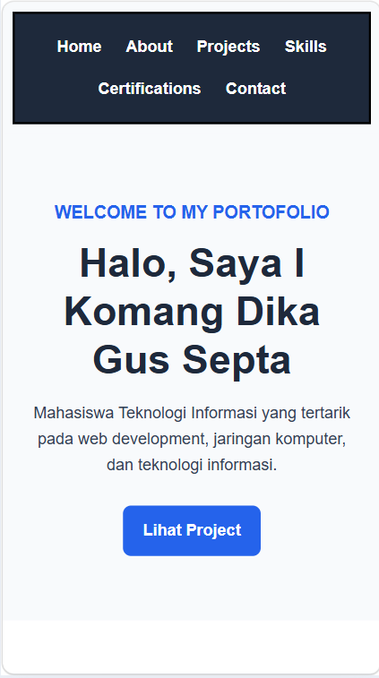
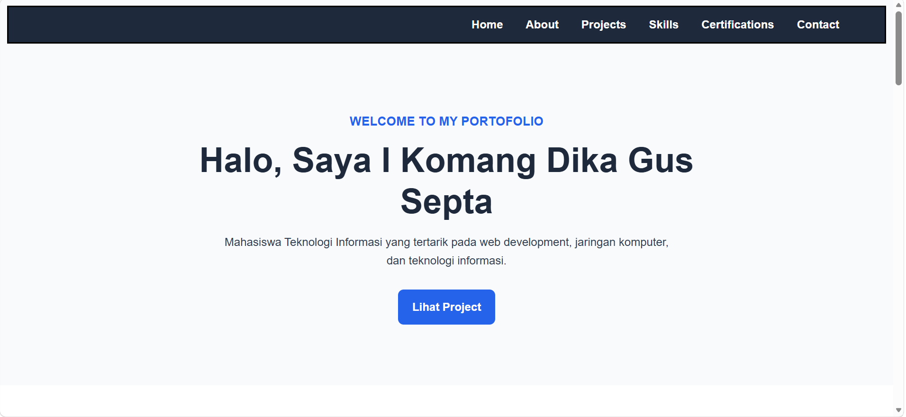
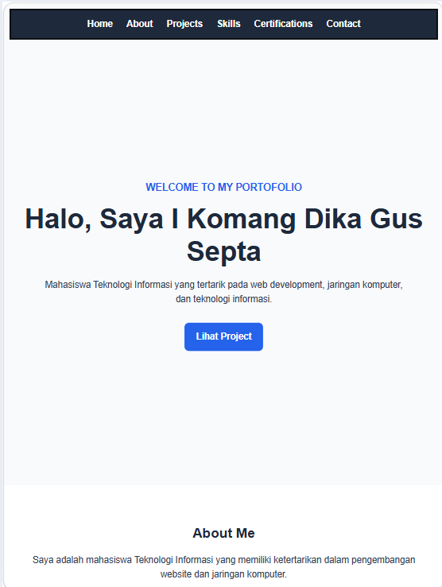
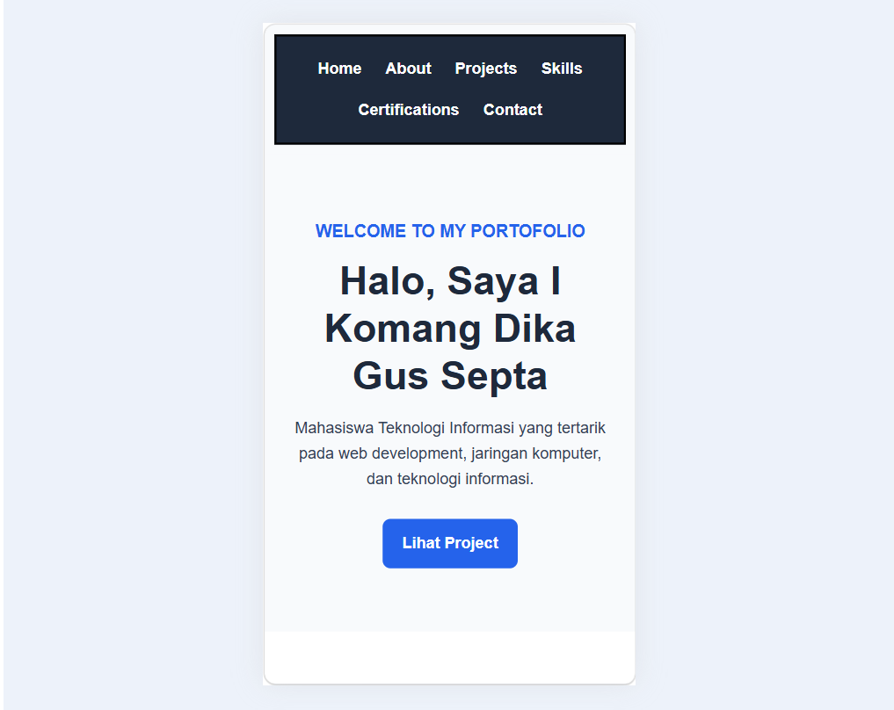
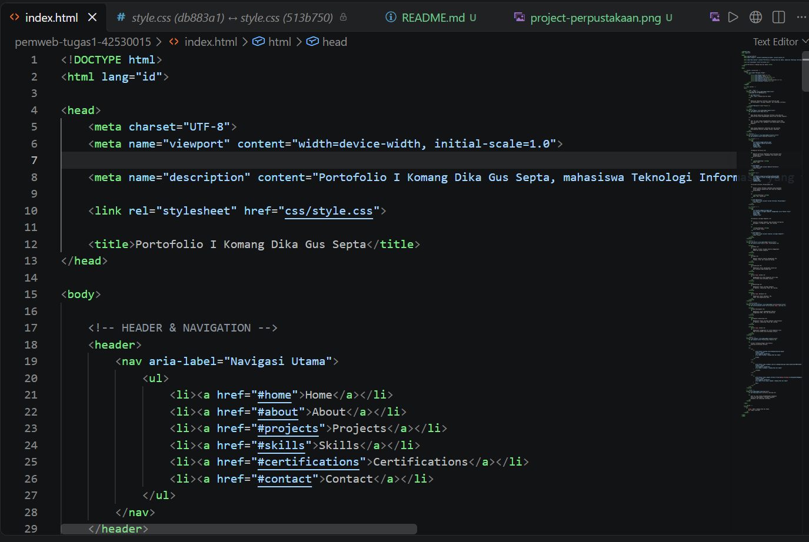
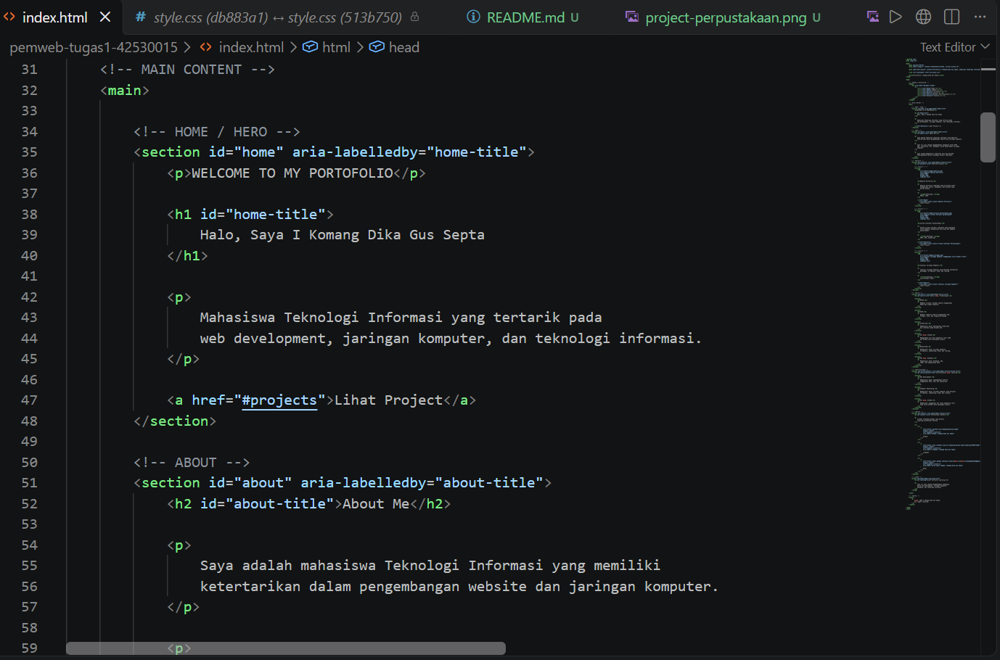

# Tugas Individu Rancang Bangun Responsive Landing Page Berbasis Dokumen Semantik HTML5 dan Tata Letak CSS Modern 

Dokumentasi dan logbook pengujian integritas kode untuk laboratorium pemrograman web modern.

Creator : I Komang Dika Gus Septa (42530015)

---
## 📌 Deskripsi Project

Website ini merupakan landing page portofolio sederhana yang dibuat menggunakan HTML5 dan CSS3. 
Website menerapkan struktur HTML semantik, Flexbox, CSS Grid, Box Model, serta responsive design agar tampilan dapat menyesuaikan berbagai ukuran layar.

---

## 📋 RUBRIK PENILAIAN ANALITIK BERSKALA (SKALA 1–4) 

| ID Uji | Fitur / Komponen | Lebar Viewport Pengujian | Ekspektasi Tampilan Antarmuka | Hasil Pengujian Aktual | Status (Pass/Fail) | Bukti Tanggap Layar |
|:---:|:---|:---|:---|:---|:---:|:---|
| **TC-01** | Navigasi Menu | Mobile (375px) | Menu tetap rapi dan tidak terpotong | Sesuai ekspektasi | **Pass** |  |
| **TC-02** | Box Model | Mobile / Desktop | Ukuran elemen sesuai `box-sizing: border-box` | Sesuai ekspektasi | **Pass** |  |
| **TC-03** | Layout Kartu | Tablet & Desktop | Kartu tersusun menggunakan Grid secara rapi | Sesuai ekspektasi | **Pass** |  |
| **TC-04** | Responsivitas | 375px – 1280px | Tampilan menyesuaikan layar tanpa scroll horizontal | Sesuai ekspektasi | **Pass** |  |
| **TC-05** | Struktur Semantik | Semua ukuran | Struktur HTML menggunakan elemen semantik | Sesuai ekspektasi | **Pass** |   |


---

## 🚀 Cara Menjalankan Proyek

1. *Clone* repositori ini:
   ```bash
   git clone https://github.com/I-Komang-Dika-Gus-Septa/pemweb-tugas1-42530015.git
2. *Masuk* kedalam folder
    ```bash
   cd pemweb-tugas1-42530015
3. *Buka* project
    ```bash 
    code . 
    ```
4. *View* project 
    ```bash
    live server
    ```